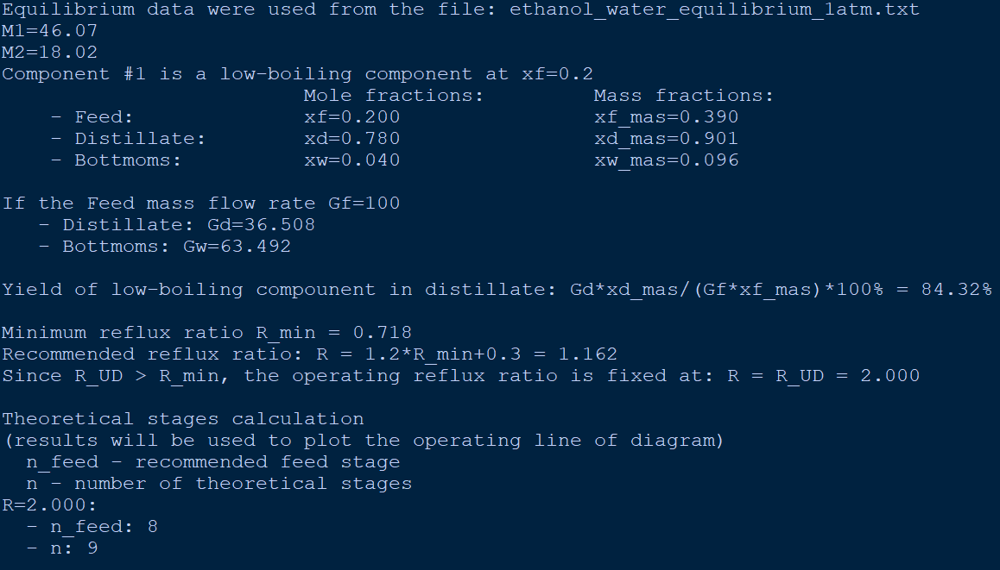

# DistillCalcs
This project is designed to model the distillation process for separating binary mixtures.
The project include two main program files to be executed:
1) Rectification_Usage – a file for calculating the rectification process.
2) Simple_Distillation_Usage – a file for calculating simple distillation.

### Rectification
"Rectification_Usage" allows you to calculate the following rectification parameters:
- Number of theoretical stages
- Feed stage
- Minimum reflux ratio
- Distillate and bottoms composition
- Distillate and bottoms flow rate for a given feed mixture flow rate

### Simple_Distillation
"Simple_Distillation_Usage" allows you to determine the composition and flows of the still residue and distillate of simple distillation depending on the degree of removal of the volatile component from the feed mixture.

## Instructions for use 
To successfully run the program, the following Python libraries must be installed:
- NumPy
- Matplotlib
- SciPy
  
### "Rectification_Usage"
1) Create a text document to store VLE data (or use the ones provided in the "data" folder).
- In the first two lines, write the molecular masses of components #1 and #2:
    - M_1=...
    - M_2=...
- Enter the VLE data starting with the third line:
    - In the first column: write the equilibrium mole fractions of component #1 in the liquid
    - In the second column: write the equilibrium mole fractions of component #1 in the vapor
- An example of filling out a file is presented in "ethanol_water_equilibrium_1atm.txt".
3) Place the created file in the "data" folder. Copy the name of the created file to the "equlibrium_data_fileName" variable.
4) Specify the mole fraction of component #1:
    - xd=... - in the distillate
    - xf=... - in the feed
    - xw=... - in the bottoms residue
5) Specify:
    - Gf=... - mass flow rate of the feed
    - R_UD=... - operating reflux ratio defined by the user (enter R_UD=0 if you want to use the empirical formula for calculating R)

### "Simple_Distillation_Usage"
1) Create a text document to store the VLE data (or use the ones provided in the "data" folder).
Enter the file name in the "equlibrium_data_fileName" variable.
2) Follow the file filling recommendations in "Rectification_Usage."
An example of filling out a file is presented in "ethanol_water_equilibrium_1atm.txt."
3) In the current file, specify the mole fraction of component #1 in the feed mixture:
    - xf=...   

### Sources:
- the VLE data presented in the "date" folder was obtained from the DWSIM program using the "Utilities" option and the "NRTL" property package.
